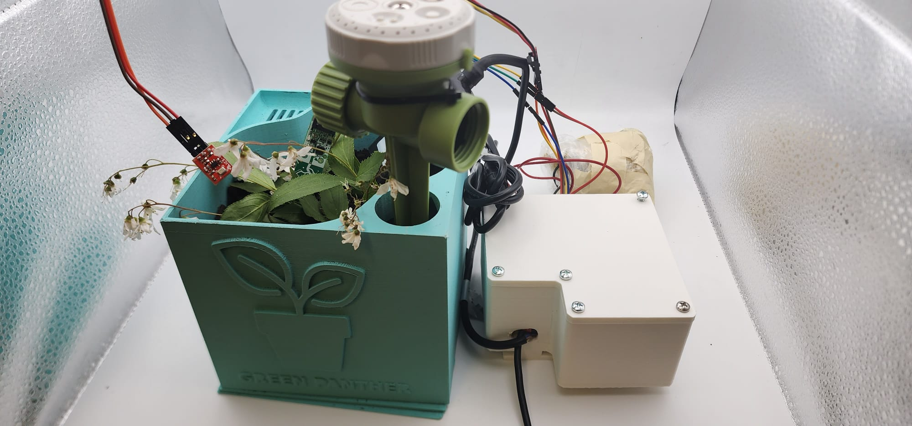
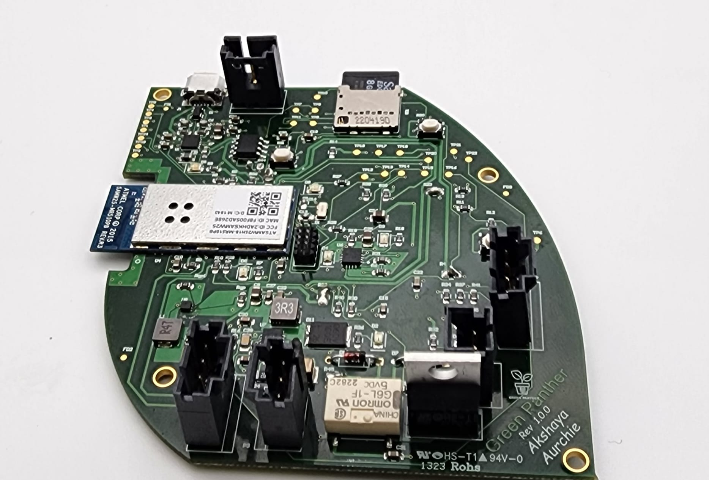
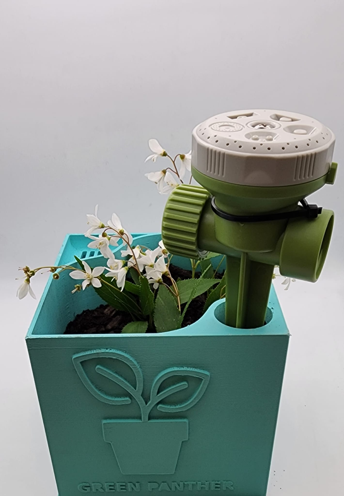

# ESE516-GreenPanther : plant health monitor measuring soil NPK levels, moisture, and watering plants as necessary.

## Team Members
Akshaya Nidhi Bhati, Aurunima Samaddar

  
  
  
  
  
  

  <em>Use navigation arrows or dots to indicate interaction.</em>

## Inspiration
The inspiration for this project came from the increasing challenges faced in agriculture and plant science due to the rise of plant diseases and water scarcity. With the global population projected to reach 9.7 billion by 2050, the need for sustainable agriculture has become more crucial than ever. According to the Food and Agriculture Organization (FAO), plant diseases can cause significant losses in crop production (up to 40 percent), resulting in economic and social consequences. In addition, water scarcity is a growing concern, with climate change exacerbating the issue.

To address these challenges, we developed a plant disease detector and self-watering system. Our project aims to provide farmers and gardeners with an efficient and cost-effective method of plant disease detection and irrigation. By using soil moisture sensors, our system detects changes in soil moisture levels and alerts the user when the plant needs watering. Additionally, our system includes a disease detection feature that uses sensors like NPK sensor and microphone to detect the presence of pathogens in the soil. By providing early warning of potential plant diseases, our system can help prevent crop losses and ensure sustainable agriculture.

The objective of this project is to design a system that can accurately detect plant diseases and provide automated watering to promote healthy plant growth. We hope that this project will contribute to the field of agriculture and plant science by providing an accessible and cost-effective solution for small-scale farmers and gardeners. The expected outcome of this project is a functional plant disease detector and self-watering system that can be implemented in various settings, including homes, gardens, and small-scale farms.

In the next section, we will discuss the methodology we used to develop our plant disease detector and self-watering system.

## What it does
The plant disease detector and self-watering system we developed is a comprehensive solution that provides automated watering and plant disease detection. The system includes three main components: the soil moisture sensor, the NPK sensor, and the microphone.

The soil moisture sensor is responsible for monitoring the moisture levels and the temperature in the soil. The sensor is buried in the soil and sends real-time data to the microcontroller. When the moisture level drops below a certain threshold, the microcontroller activates the relay which sends the switches on the solenoidal valve, which waters the plant using the sprinkler. The system ensures that the plant receives the appropriate amount of water, promoting healthy growth and preventing over-watering.

The NPK sensor and the microphone are responsible for detecting the presence of pathogens in the soil. The NPK sensor is also buried in the soil and sends real-time data to the microcontroller. It will show the Nitrogen, Potassium, and the Phosphorus value of the soil. If they are below certain threshold. It indicates unhealthy plant. We can further use machine learning algorithms to analyze the data and identify patterns associated with plant diseases in future. If a potential disease is detected, the system alerts the user through a mobile application. This early warning system allows the user to take appropriate action, such as removing the infected plant, before the disease spreads to other plants.

Overall, the plant disease detector and self-watering system provides a comprehensive solution for plant care. By automating the watering process and providing early detection of plant diseases, the system helps promote healthy plant growth and prevent crop losses.

## How we built it
How we built it The development of our plant disease detector and self-watering system involved a combination of hardware design, software development, and integration. Here is an overview of the process and tools we used: Hardware Design We started by designing the hardware components of the system. This included selecting and sourcing the necessary sensors, microcontrollers, actuators, and other electronic components. We used Altium Designer, a professional PCB design software, to create the circuit schematics, layout, and routing for the PCB. The design phase also involved ensuring proper power supply, signal conditioning, and connectivity between the components. Software Development Once the hardware design was finalized, we moved on to software development. We programmed the microcontroller to interface with the sensors, collect data, and control the actuators. We used embedded C programming language to write the firmware for the microcontroller. Additionally, we developed a web-based user interface using Node-RED, an open-source flow-based programming tool. This allowed users to monitor and control the system remotely. Integration The integration phase involved connecting the hardware and software components together. We carefully assembled the PCB, ensuring proper connections and alignments. We calibrated and tested the sensors to ensure accurate readings. We also integrated the microcontroller with the Node-RED interface to enable seamless communication and control between the user interface and the system.

Overall, the development of our plant disease detector and self-watering system involved a combination of hardware design, software development, and integration. Through careful planning, iteration, and testing, we were able to create a functional and reliable system that addresses the challenges in plant care.

## Challenges we ran into
One of the challenges we encountered during the project was related to the soil moisture sensor, which used I2C communication protocol. We realized that we were not using the default pins for I2C, which were PA08 and PA09, and were instead using PA17 and PA22. This caused some confusion as we were not aware that we needed to initialize the I2C communication on these pins before implementation. Ultimately, we were able to resolve the issue by carefully reviewing the sensor documentation and adjusting our code accordingly. Despite this setback, we were able to successfully integrate the soil moisture sensor into our project and collect accurate data.

## Accomplishments that we're proud of
As a team, we are incredibly proud of what we accomplished throughout this project. We were able to design and implement a fully functional system that met our project objectives, which included measuring soil moisture levels, controlling the relay and sprinkler based on those measurements, and logging data to a cloud server for further analysis.

We designed the entire PCB for the system using Altium Designer. The PCB design included the circuit schematics, layout, and routing. We also ensured that the design complied with industry standards and regulations. This accomplishment demonstrates our ability to design complex systems using professional-grade tools.

We integrated the system with Node-RED, an open-source flow-based programming tool. We used Node-RED to create a web-based user interface that allows users to monitor and control the system remotely. The integration with Node-RED allowed us to create a user-friendly interface that is accessible to a wider range of users.

One of our biggest accomplishments was the successful integration of multiple components into a single system. We were able to combine a variety of hardware components, including the microcontroller, soil moisture sensor, solenoidal valve, along with software components like the MQTT protocol and cloud-based database, to create a cohesive and functional system.

Another accomplishment we're proud of is our teamwork and communication throughout the project. We worked collaboratively to assign tasks and ensure that both of us were able to contribute to the project in a meaningful way. We also communicated effectively about any challenges we encountered and worked together to find solutions. Overall, we are proud of the hard work and dedication that we put into this project and are excited about the potential applications of our system for improving agricultural practices.

## What we learned
The development of our plant disease detector and self-watering system was a challenging but rewarding experience. Throughout the project, we learned several valuable lessons that we believe will benefit us in our future endeavors. Here are some of the key takeaways from our project:

Importance of Research and Planning We learned the importance of conducting thorough research and planning before beginning any project. By researching the challenges faced in agriculture and plant science, we were able to identify the need for a plant disease detector and self-watering system. We then planned the project, including the hardware and software components, to ensure that it met the needs of end-users.

Value of Collaboration and Communication We learned the value of collaboration and communication in a team project. Our team consisted of two individuals with diverse skill sets. By collaborating and communicating effectively, we were able to leverage our strengths and work together towards a common goal. This experience taught us the importance of effective communication and collaboration in achieving project success.

Technical Skills Development We developed several technical skills throughout the project, including circuit design, PCB layout, and programming. This experience helped us to expand our technical knowledge and gain hands-on experience in developing complex systems. We also learned the importance of continuous learning and staying up-to-date with the latest technologies and industry standards.

Importance of Iterative Design We learned the importance of iterative design in the development of complex systems. Throughout the project, we encountered several challenges and obstacles. By using an iterative design approach, we were able to identify and address these issues, improving the functionality and reliability of the system.

Overall, we learned valuable lessons in research, planning, collaboration, technical skills development, and iterative design. We believe that these lessons will benefit us in our future endeavors, both personally and professionally.

## What's next for Green Panther
While our plant disease detector and self-watering system is functional, we believe that there is still room for improvement. Our plans for the future of Green Panther include Implementing Machine Learning. In the next phase of our project, we plan to incorporate machine learning algorithms to improve the accuracy and reliability of our plant disease detection system. By training the system on large datasets of plant’s Nitrogen, Phosphorus and Potassium values from soil, we aim to develop a more robust and effective system that can accurately identify a wide range of plant diseases.
